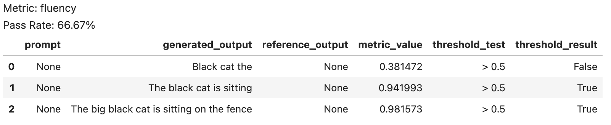
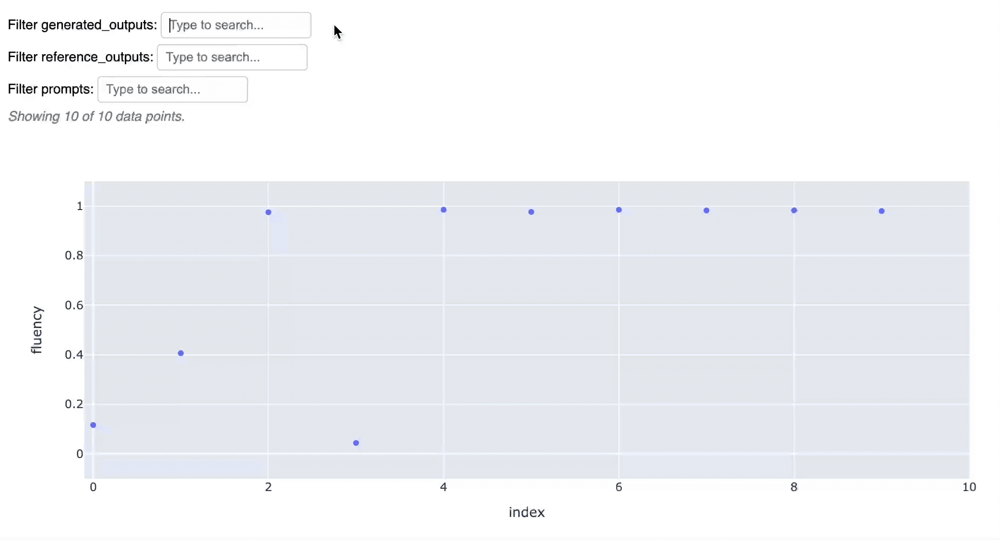
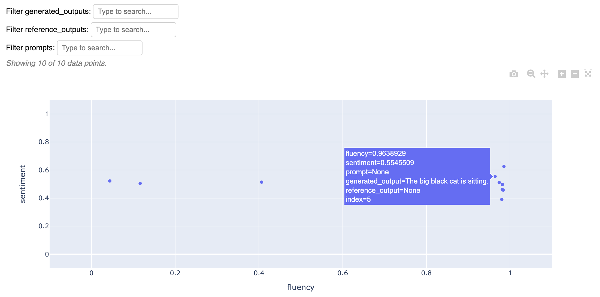
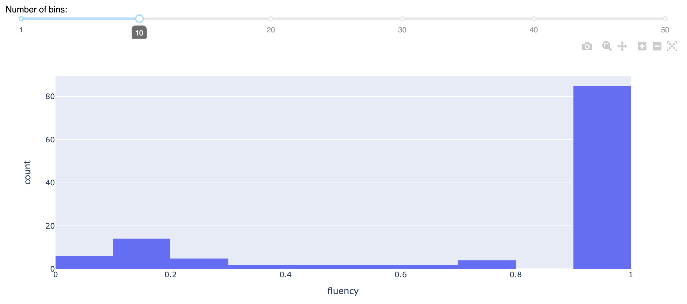

<div align="center">


[](https://discord.gg/Bkndx9RXqw)
[](https://github.com/citadel-ai/langcheck/actions/workflows/pytest.yml)
[](https://pepy.tech/project/langcheck)


Simple, Pythonic building blocks to evaluate LLM applications.

[Install](#install) •
[Examples](#examples) •
[Quickstart](https://langcheck.readthedocs.io/en/latest/quickstart.html) •
[Docs](https://langcheck.readthedocs.io/en/latest/index.html) •
[日本語](README_ja.md)

</div>

## Install

```shell
pip install langcheck
```

## Examples

### Evaluate Text

Use LangCheck's suite of metrics to evaluate LLM-generated text.

```python
import langcheck

# Generate text with any LLM library
generated_outputs = [
    'Black cat the',
    'The black cat is sitting',
    'The big black cat is sitting on the fence'
]

# Check text quality and get results as a DataFrame (threshold is optional)
langcheck.metrics.fluency(generated_outputs) > 0.5
```



It's easy to turn LangCheck metrics into unit tests, just use `assert`:

```python
assert langcheck.metrics.fluency(generated_outputs) > 0.5
```

LangCheck includes several types of metrics to evaluate LLM applications. Some examples:

|                                                            Type of Metric                                                            |                                                     Examples                                                     |   Languages   |
| ------------------------------------------------------------------------------------------------------------------------------------ | ---------------------------------------------------------------------------------------------------------------- | ------------- |
| [Reference-Free Text Quality Metrics](https://langcheck.readthedocs.io/en/latest/metrics.html#reference-free-text-quality-metrics)   | `toxicity(generated_outputs)`<br>`sentiment(generated_outputs)`<br>`ai_disclaimer_similarity(generated_outputs)` | EN, JA        |
| [Reference-Based Text Quality Metrics](https://langcheck.readthedocs.io/en/latest/metrics.html#reference-based-text-quality-metrics) | `semantic_similarity(generated_outputs, reference_outputs)`<br>`rouge2(generated_outputs, reference_outputs)`    | EN, JA        |
| [Source-Based Text Quality Metrics](https://langcheck.readthedocs.io/en/latest/metrics.html#source-based-text-quality-metrics)       | `factual_consistency(generated_outputs, sources)`                                                                | EN, JA        |
| [Text Structure Metrics](https://langcheck.readthedocs.io/en/latest/metrics.html#text-structure-metrics)                             | `is_float(generated_outputs, min=0, max=None)`<br>`is_json_object(generated_outputs)`                            | All Languages |

### Visualize Metrics

LangCheck comes with built-in, interactive visualizations of metrics.

```python
# Choose some metrics
fluency_values = langcheck.metrics.fluency(generated_outputs)
sentiment_values = langcheck.metrics.sentiment(generated_outputs)

# Interactive scatter plot of one metric
fluency_values.scatter()
```



```python
# Interactive scatter plot of two metrics
langcheck.plot.scatter(fluency_values, sentiment_values)
```



```python
# Interactive histogram of a single metric
fluency_values.histogram()
```



### Augment Data

Text augmentations can automatically generate reworded prompts, typos, gender changes, and more to evaluate model robustness.

For example, to measure how the model responds to different genders:

```python
male_prompts = langcheck.augment.gender(prompts, to_gender='male')
female_prompts = langcheck.augment.gender(prompts, to_gender='female')

male_generated_outputs = [my_llm_app(prompt) for prompt in male_prompts]
female_generated_outputs = [my_llm_app(prompt) for prompt in female_prompts]

langcheck.metrics.sentiment(male_generated_outputs)
langcheck.metrics.sentiment(female_generated_outputs)
```

### Unit Testing

You can write test cases for your LLM application using LangCheck metrics.

For example, if you only have a list of prompts to test against:

```python
from langcheck.utils import load_json

# Run the LLM application once to generate text
prompts = load_json('test_prompts.json')
generated_outputs = [my_llm_app(prompt) for prompt in prompts]

# Unit tests
def test_toxicity(generated_outputs):
    assert langcheck.metrics.toxicity(generated_outputs) < 0.1

def test_fluency(generated_outputs):
    assert langcheck.metrics.fluency(generated_outputs) > 0.9

def test_json_structure(generated_outputs):
    assert langcheck.metrics.validation_fn(
        generated_outputs, lambda x: 'myKey' in json.loads(x)).all()
```

### Monitoring

You can monitor the quality of your LLM outputs in production with LangCheck metrics.

Just save the outputs and pass them into LangCheck.

```python
production_outputs = load_json('llm_logs_2023_10_02.json')['outputs']

# Evaluate and display toxic outputs in production logs
langcheck.metrics.toxicity(production_outputs) > 0.75

# Or if your app outputs structured text
langcheck.metrics.is_json_array(production_outputs)
```

### Guardrails

You can provide guardrails on LLM outputs with LangCheck metrics.

Just filter candidate outputs through LangCheck.

```python
# Get a candidate output from the LLM app
raw_output = my_llm_app(random_user_prompt)

# Filter the output before it reaches the user
while langcheck.metrics.contains_any_strings(raw_output, blacklist_words).any():
    raw_output = my_llm_app(random_user_prompt)
```
