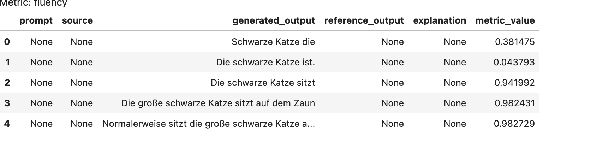
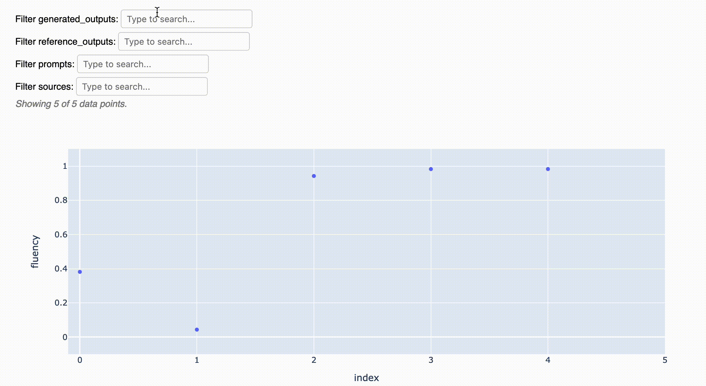
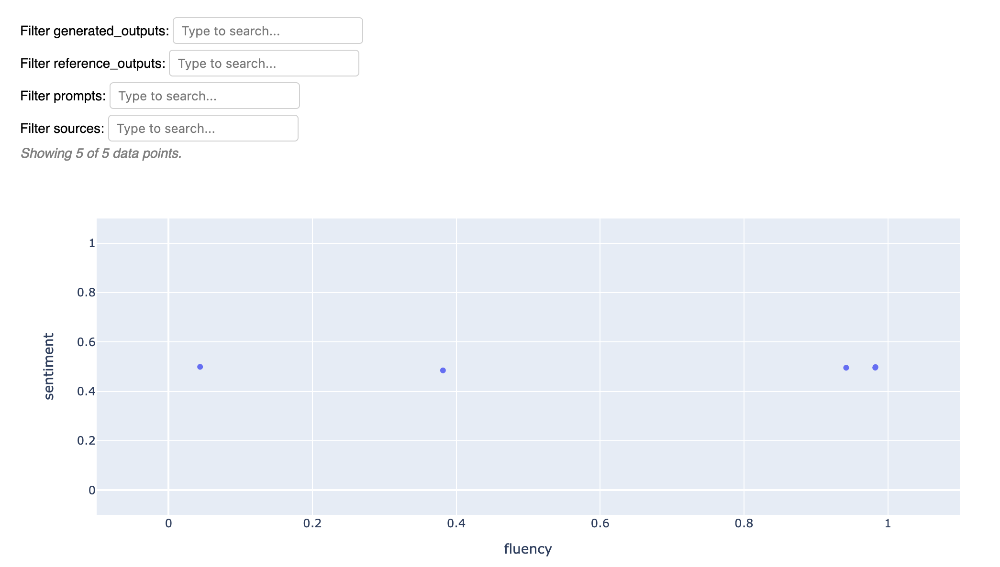
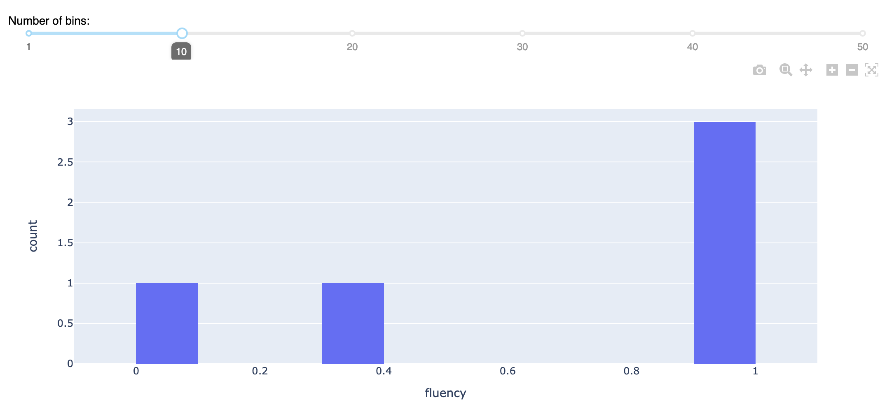

<div align="center">


[](https://discord.gg/Bkndx9RXqw)
[](https://github.com/citadel-ai/langcheck/actions/workflows/pytest.yml)
[](https://pepy.tech/project/langcheck)


Einfache, pythonische Bausteine zur Bewertung von LLM-Anwendungen.

[Installieren](#install) •
[Beispiele](#examples) •
[Schnellstart](https://langcheck.readthedocs.io/en/latest/quickstart.html) •
[Docs](https://langcheck.readthedocs.io/en/latest/index.html) •
[English](README.md) •
[日本語](README_ja.md) •
[中文](README_zh.md)

</div>

## Installieren

```shell
pip install langcheck[de]
```

## Beispiele

### Text bewerten

Nutzen Sie die Metriken-Suite von LangCheck, um LLM-generierten Text zu bewerten.

```python
import langcheck
import langcheck.metrics.de

# Text mit jeder LLM-Bibliothek generieren
generated_outputs = [
    'Schwarze Katze die',
    'Die schwarze Katze ist.',
    'Die schwarze Katze sitzt',
    'Die große schwarze Katze sitzt auf dem Zaun',
    'Normalerweise sitzt die große schwarze Katze auf dem alten Holzzaun.'
]

# Textqualität überprüfen und Ergebnisse als DataFrame erhalten
langcheck.metrics.de.fluency(generated_outputs)
```



Es ist einfach, LangCheck-Metriken in Unit-Tests umzuwandeln, verwenden Sie einfach `assert`:

```python
assert langcheck.metrics.de.fluency(generated_outputs) > 0.5
```

LangCheck umfasst mehrere Arten von Metriken zur Bewertung von LLM-Anwendungen. Einige Beispiele:

|                                                            Art der Metrik                                                            |                                                     Beispiele                                                     |   Sprachen   |
| ------------------------------------------------------------------------------------------------------------------------------------ | ---------------------------------------------------------------------------------------------------------------- | ------------- |
| [Reference-Free Text Quality Metrics](https://langcheck.readthedocs.io/en/latest/metrics.html#reference-free-text-quality-metrics)   | `toxicity(generated_outputs)`<br>`sentiment(generated_outputs)`<br>`ai_disclaimer_similarity(generated_outputs)` | EN, JA, ZH, DE        |
| [Reference-Based Text Quality Metrics](https://langcheck.readthedocs.io/en/latest/metrics.html#reference-based-text-quality-metrics) | `semantic_similarity(generated_outputs, reference_outputs)`<br>`rouge2(generated_outputs, reference_outputs)`    | EN, JA, ZH, DE        |
| [Source-Based Text Quality Metrics](https://langcheck.readthedocs.io/en/latest/metrics.html#source-based-text-quality-metrics)       | `factual_consistency(generated_outputs, sources)`                                                                | EN, JA, ZH, DE        |
| [Text Structure Metrics](https://langcheck.readthedocs.io/en/latest/metrics.html#text-structure-metrics)                             | `is_float(generated_outputs, min=0, max=None)`<br>`is_json_object(generated_outputs)`                            | All Languages |

### Metriken visualisieren.

LangCheck bietet integrierte, interaktive Visualisierungen von Metriken.

```python
# Einige Metriken auswählen
fluency_values = langcheck.metrics.de.fluency(generated_outputs)
sentiment_values = langcheck.metrics.de.sentiment(generated_outputs)

# Interaktives Streudiagramm einer Metrik
fluency_values.scatter()
```



```python
# Interaktives Streudiagramm von zwei Metriken
langcheck.plot.scatter(fluency_values, sentiment_values)
```



```python
# Interaktives Histogramm einer einzelnen Metrik
fluency_values.histogram()
```



### Daten erweitern

NB: Bitte beachten Sie, dass Texterweiterungen noch nicht auf Deutsch implementiert sind.

Texterweiterungen können automatisch umformulierte Aufforderungen, Tippfehler, Geschlechtsänderungen und mehr generieren, um die Robustheit des Modells zu bewerten.

Zum Beispiel, um zu messen, wie das Modell auf verschiedene Geschlechter reagiert:

```python
male_prompts = langcheck.augment.gender(prompts, to_gender='male')
female_prompts = langcheck.augment.gender(prompts, to_gender='female')

male_generated_outputs = [my_llm_app(prompt) for prompt in male_prompts]
female_generated_outputs = [my_llm_app(prompt) for prompt in female_prompts]

langcheck.metrics.sentiment(male_generated_outputs)
langcheck.metrics.sentiment(female_generated_outputs)
```

### Unit Testing

Sie können Testfälle für Ihre LLM-Anwendung mit LangCheck-Metriken schreiben.

Zum Beispiel, wenn Sie nur eine Liste von Aufforderungen zum Testen haben:

```python
from langcheck.utils import load_json

# Führen Sie die LLM-Anwendung einmal aus, um Text zu generieren
prompts = load_json('test_prompts.json')
generated_outputs = [my_llm_app(prompt) for prompt in prompts]

# Unit tests
def test_toxicity(generated_outputs):
    assert langcheck.metrics.toxicity(generated_outputs) < 0.1

def test_fluency(generated_outputs):
    assert langcheck.metrics.fluency(generated_outputs) > 0.9

def test_json_structure(generated_outputs):
    assert langcheck.metrics.validation_fn(
        generated_outputs, lambda x: 'myKey' in json.loads(x)).all()
```

### Monitoring

Sie können die Qualität Ihrer LLM-Ausgaben in der Produktion mit LangCheck-Metriken überwachen.

Speichern Sie einfach die Ausgaben und geben Sie sie in LangCheck ein.

```python
production_outputs = load_json('llm_logs_2023_10_02.json')['outputs']

# Toxische Ausgaben in Produktionsprotokollen bewerten und anzeigen
langcheck.metrics.toxicity(production_outputs) > 0.75

# Oder wenn Ihre App strukturierten Text ausgibt
langcheck.metrics.is_json_array(production_outputs)
```

### Guardrails

Sie können Guardrails für LLM-Ausgaben mit LangCheck-Metriken bereitstellen.

Filtern Sie einfach Kandidatenausgaben durch LangCheck.

```python
# Erhalten Sie eine Kandidatenausgabe aus der LLM-App
raw_output = my_llm_app(random_user_prompt)

# Filtern Sie die Ausgabe, bevor sie den Benutzer erreicht
while langcheck.metrics.contains_any_strings(raw_output, blacklist_words).any():
    raw_output = my_llm_app(random_user_prompt)
```
