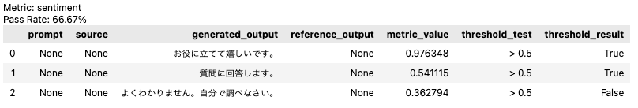

<div align="center">


[](https://discord.gg/Bkndx9RXqw)
[](https://github.com/citadel-ai/langcheck/actions/workflows/pytest.yml)
[](https://pepy.tech/project/langcheck)


LLMアプリケーションの評価のためのシンプルなPythonライブラリです。

[インストール](#インストール) •
[利用例](#利用例) •
[クイックスタート](https://langcheck.readthedocs.io/en/latest/quickstart.html) •
[ドキュメント](https://langcheck.readthedocs.io/en/latest/index.html) •
[English](README.md) •
[中文](README_zh.md) •
[Deutsch](README_de.md)


</div>

## インストール

```shell
pip install langcheck
```

インストールがうまくいかない場合、[FAQ(英語)](https://langcheck.readthedocs.io/en/latest/installation.html#installation-faq)もご覧ください。

## 利用例

### テキスト評価

様々な指標を使って、LLMの生成したテキストを評価することができます。

```python
from langcheck.metrics.ja import sentiment

# LLMを使って生成したテキストを入力する
generated_outputs = [
    'お役に立てて嬉しいです。',
    '質問に回答します。',
    'よくわかりません。自分で調べなさい。'
]

# テキストに含まれる感情表現を分析する(閾値に基づくテストも可能)
sentiment(generated_outputs) > 0.5
```



`assert`を使うことで、LangCheckの各指標を簡単にユニットテストに変換できます。

```python
assert sentiment(generated_outputs) > 0.5
```

LangCheckには、他にも以下のようなLLMアプリケーションを評価するための指標が含まれています。

|                                                                 種類                                                                 |                                                   主な指標                                                    |     言語     |
| ------------------------------------------------------------------------------------------------------------------------------------ | ------------------------------------------------------------------------------------------------------------- | ------------ |
| [Reference-Free Text Quality Metrics](https://langcheck.readthedocs.io/en/latest/metrics.html#reference-free-text-quality-metrics)   | `toxicity(generated_outputs)`<br>`sentiment(generated_outputs)`                                               | 英語、日本語、中国語、ドイツ語 |
| [Reference-Based Text Quality Metrics](https://langcheck.readthedocs.io/en/latest/metrics.html#reference-based-text-quality-metrics) | `semantic_similarity(generated_outputs, reference_outputs)`<br>`rouge2(generated_outputs, reference_outputs)` | 英語、日本語、中国語、ドイツ語 |
| [Source-Based Text Quality Metrics](https://langcheck.readthedocs.io/en/latest/metrics.html#source-based-text-quality-metrics)       | `factual_consistency(generated_outputs, sources)`                                                             | 英語、日本語、中国語、ドイツ語 |
| [Text Structure Metrics](https://langcheck.readthedocs.io/en/latest/metrics.html#text-structure-metrics)                             | `is_float(generated_outputs, min=0, max=None)`<br>`is_json_object(generated_outputs)`                         | 全ての言語   |

### 数値の可視化

LangCheckでは、他にもインタラクティブなグラフを使って数値を可視化することができます。

```python
# いくつかの指標を選ぶ　
sentiment_values = langcheck.metrics.ja.sentiment(generated_outputs)
toxicity_values = langcheck.metrics.ja.toxicity(generated_outputs)

# ひとつの指標についてのインタラクティブな散布図
sentiment_values.scatter()
```


```python
# 複数の指標についてのインタラクティブな散布図
langcheck.plot.scatter(sentiment_values, toxicity_values)
```


```python
# インタラクティブなヒストグラム
toxicity_values.histogram()
```


### データの拡張 (近日公開)

```python
more_prompts = []
more_prompts += langcheck.augment.keyboard_typo(prompts)
more_prompts += langcheck.augment.ocr_typo(prompts)
more_prompts += langcheck.augment.synonym(prompts)
more_prompts += langcheck.augment.gender(prompts, to_gender='male')
more_prompts += langcheck.augment.gpt35_rewrite(prompts)
```

### ユニットテスト

LangCheckを使うことで、LLMアプリケーションのユニットテストを簡単に書くことができます。

例えば、テスト用のプロンプトを保存しておくだけで、以下のようにテストを行えます。

```python
from langcheck.utils import load_json

# LLMアプリケーションをテスト用プロンプトに対して走らせ、出力を得る
prompts = load_json('test_prompts.json')
generated_outputs = [my_llm_app(prompt) for prompt in prompts]

# ユニットテスト　
def test_toxicity(generated_outputs):
    assert langcheck.metrics.toxicity(generated_outputs) < 0.1

def test_fluency(generated_outputs):
    assert langcheck.metrics.fluency(generated_outputs) > 0.9

def test_json_structure(generated_outputs):
    assert langcheck.metrics.validation_fn(
        generated_outputs, lambda x: 'myKey' in json.loads(x)).all()
```

### モニタリング

本番環境のLLMの出力のモニタリングにもLangCheckを活用できます。

LLMの出力を保存して、LangCheckに入力してください。

```python
from langcheck.utils import load_json

production_outputs = load_json('llm_logs_2023_10_02.json')['outputs']

# 有害性の高い出力になっていないかを調べる。
langcheck.metrics.ja.toxicity(production_outputs) > 0.75

# 出力がJSON形式になっているかを調べる
langcheck.metrics.is_json_array(production_outputs)
```

### ガードレール

他にも、LLMの出力の安全性を高めるガードレールとしてもお使いいただけます。

```python
# LLMからいったん出力を得る
raw_output = my_llm_app(random_user_prompt)

# 不適切な単語が含まれていた場合、別の出力を作って上書きする
while langcheck.metrics.contains_any_strings(raw_output, blacklist_words).any():
    raw_output = my_llm_app(random_user_prompt)
```
