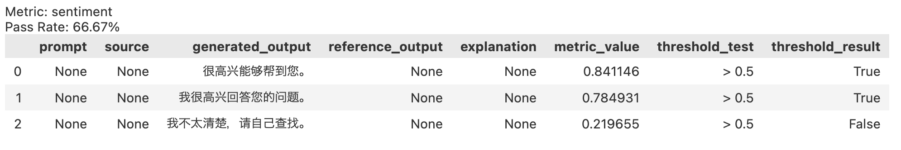
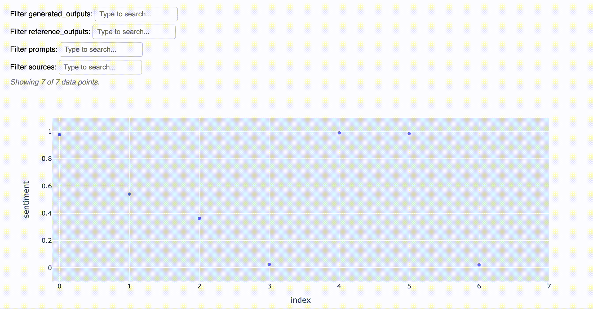
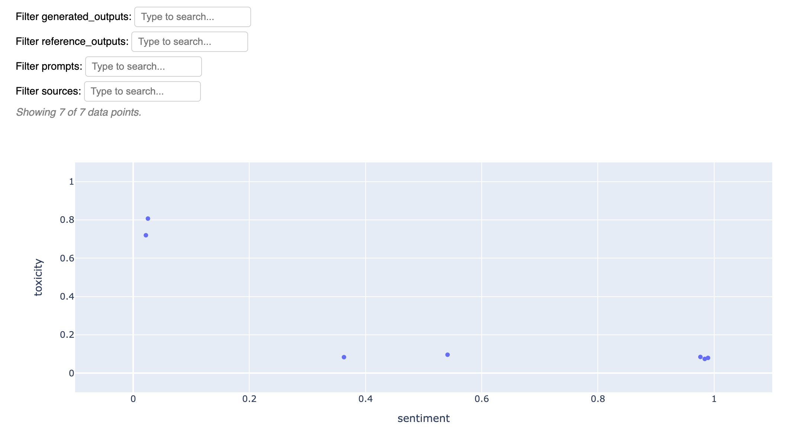
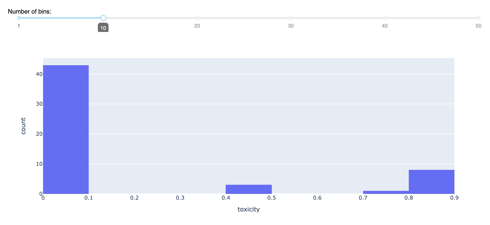

<div align="center">


[](https://discord.gg/Bkndx9RXqw)
[](https://github.com/citadel-ai/langcheck/actions/workflows/pytest.yml)
[](https://pepy.tech/project/langcheck)


这是一个简单的Python库，用于评估LLM应用程序。

[安装](#安装) •
[使用示例](#使用示例) •
[快速开始](https://langcheck.readthedocs.io/en/latest/quickstart.html) •
[文档](https://langcheck.readthedocs.io/en/latest/index.html) •
[English](README.md) •
[Deutsch](README_de.md)

</div>

## 安装

```shell
pip install langcheck
```

如果安装不成功，请查看[常见问题解答(英文)](https://langcheck.readthedocs.io/en/latest/installation.html#installation-faq)。

## 使用示例

### 文本评估

您可以使用各种指标来评估LLM生成的文本。

```python
from langcheck.metrics.zh import sentiment

# 输入LLM生成的文本
generated_outputs = [
    '很高兴能够帮到您。',
    '我很高兴回答您的问题。',
    '我不太清楚，请自己查找。'
]

# 分析文本中的情绪表达（也可以基于阈值进行测试）
sentiment(generated_outputs) > 0.5
```



通过使用`assert`，您可以轻松地将LangCheck的各种指标转换为单元测试。

```python
assert sentiment(generated_outputs) > 0.5
```

LangCheck还包含了以下用于评估LLM应用程序的指标。

|                                                                 类型                                                                 |                                                   主要指标                                                    |     语言     |
| ------------------------------------------------------------------------------------------------------------------------------------ | ------------------------------------------------------------------------------------------------------------- | ------------ |
| [无参考文本质量指标](https://langcheck.readthedocs.io/en/latest/metrics.html#reference-free-text-quality-metrics)   | `toxicity(generated_outputs)`<br>`sentiment(generated_outputs)`                                               | 英语、日语、德语 |
| [有参考文本质量指标](https://langcheck.readthedocs.io/en/latest/metrics.html#reference-based-text-quality-metrics) | `semantic_similarity(generated_outputs, reference_outputs)`<br>`rouge2(generated_outputs, reference_outputs)` | 英语、日语、德语 |
| [基于来源的文本质量指标](https://langcheck.readthedocs.io/en/latest/metrics.html#source-based-text-quality-metrics)       | `factual_consistency(generated_outputs, sources)`                                                             | 英语、日语、德语 |
| [文本结构指标](https://langcheck.readthedocs.io/en/latest/metrics.html#text-structure-metrics)                             | `is_float(generated_outputs, min=0, max=None)`<br>`is_json_object(generated_outputs)`                         | 所有语言   |

### 数值可视化

LangCheck还可以使用交互式图表来可视化数值。

```python
# 选择一些指标
sentiment_values = langcheck.metrics.zh.sentiment(generated_outputs)
toxicity_values = langcheck.metrics.zh.toxicity(generated_outputs)

# 关于一个指标的交互式散点图
sentiment_values.scatter()
```



```python
# 关于多个指标的交互式散点图
langcheck.plot.scatter(sentiment_values, toxicity_values)
```



```python
# 交互式直方图
toxicity_values.histogram()
```



### 数据增强（即将推出）

```python
more_prompts = []
more_prompts += langcheck.augment.keyboard_typo(prompts)
more_prompts += langcheck.augment.ocr_typo(prompts)
more_prompts += langcheck.augment.synonym(prompts)
more_prompts += langcheck.augment.gender(prompts, to_gender='male')
more_prompts += langcheck.augment.gpt35_rewrite(prompts)
```

### 单元测试

使用LangCheck，您可以轻松编写LLM应用程序的单元测试。

例如，仅需保存测试用的提示，就可以进行如下测试：

```python
from langcheck.utils import load_json

# 对LLM应用程序使用测试用的提示并获取输出
prompts = load_json('test_prompts.json')
generated_outputs = [my_llm_app(prompt) for prompt in prompts]

# 单元测试
def test_toxicity(generated_outputs):
    assert langcheck.metrics.zh.toxicity(generated_outputs) < 0.1


def test_json_structure(generated_outputs):
    assert langcheck.metrics.validation_fn(
        generated_outputs, lambda x: 'myKey' in json.loads(x)).all()
```

### 监控

您也可以利用LangCheck来监控生产环境中LLM的输出。

请保存LLM的输出，并输入到LangCheck中。

```python
from langcheck.utils import load_json

production_outputs = load_json('llm_logs_2023_10_02.json')['outputs']

# 检查输出是否存在高毒性。
langcheck.metrics.ja.toxicity(production_outputs) > 0.75

# 检查输出是否为JSON格式
langcheck.metrics.is_json_array(production_outputs)
```

### 安全防护

您还可以将其作为提高LLM输出安全性的防护措施。

```python
# 从LLM获取一次输出
raw_output = my_llm_app(random_user_prompt)

# 如果包含不适当的词汇，则创建另一个输出来覆盖
while langcheck.metrics.contains_any_strings(raw_output, blacklist_words).any():
    raw_output = my_llm_app(random_user_prompt)
```