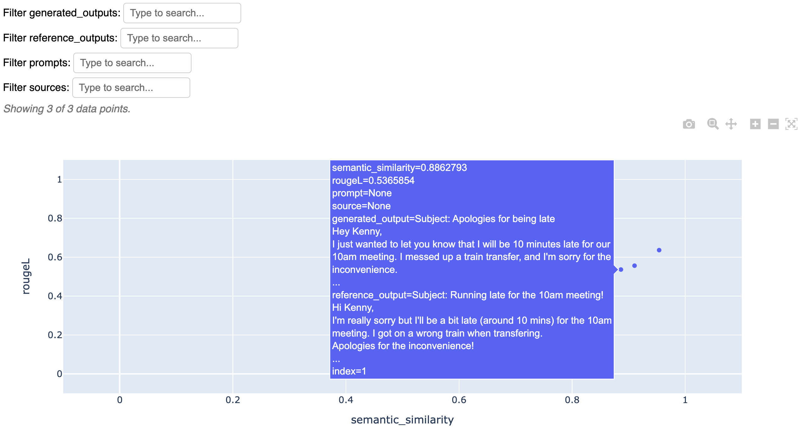
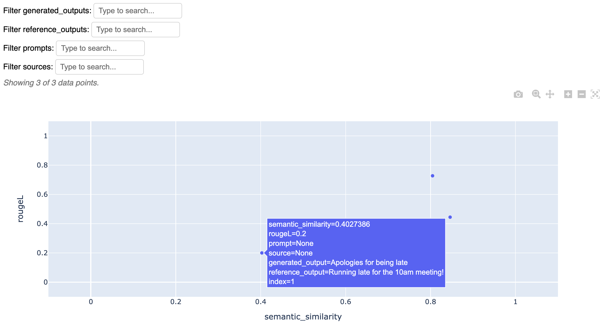

# Evaluating an Email Generator

In this tutorial, we will walk through how we can use LangCheck to evaluate a simple email generator app based on the OpenAI API.

## Building a Simple Email Generator

Let’s start with a simple prompt template that takes in the `recipient_name` and `content_description` as inputs. We want the OpenAI model (gpt-3.5-turbo in this case) to generate an email that follows the content instructions, addressed to the recipient.

```python
import openai

openai.api_key = 'YOUR_OPENAI_API_KEY'


def generate_email(recipient_name, content_description):
    prompt = (f"""Compose an email to {recipient_name}.
        The email should cover the following points: {content_description}.
        Keep it concise, and follow the following format:
        ###
        Subject: <appropriate subject>

        <Email content>
        ###
        """)
    response = openai.ChatCompletion.create(model='gpt-3.5-turbo',
                                            messages=[{
                                                "role": "system",
                                                "content": prompt
                                            }],
                                            max_tokens=500)
    email_body = response['choices'][0]['message']['content'].strip()
    return email_body
```

Now, let's try it out on a couple of examples.
```python
recipient_name = "Alex"
content_description = """
- Quick update on the Japan trip
- Got to Tokyo yesterday and visited Tokyo Sky Tree
- Favorite part so far is the food, particularly ramen
"""
email = generate_email(recipient_name, content_description)
print(email)

recipient_name = "Kenny"
content_description = """
- will be 10 minues late for the 10am meeting
- messed up a train transfer
- apologies for the inconvenience
"""
email = generate_email(recipient_name, content_description)
print(email)
```

Below are the app's outputs on those two examples.

> Subject: Japan Trip Update
>
> Hey Alex,
>
> Just wanted to give you a quick update on the Japan trip. We arrived in Tokyo yesterday and visited Tokyo Sky Tree, which was amazing! The view from the top was breathtaking.
>
> So far, my favorite part of the trip has been trying the local food, especially ramen. It's absolutely delicious!
>
> I'll keep you posted on any further updates.
>
> Take care,  
> [Your Name]

> Subject: Running Late for 10am Meeting
>
> Hi Kenny,
>
> I just wanted to give you a heads up that I will be approximately 10 minutes late for our 10am meeting this morning. I encountered a train transfer issue while commuting to the office.
>
> I apologize for any inconvenience this may cause and I'll make sure to catch up promptly once I arrive.
>
> Best regards,  
> [Your Name]

Based on these couple examples, it seems like the app is doing a pretty good job. However, it's not always perfect - in the example below, the app "hallucinates" a bunch of fake qualifications that we did not specify!

```python
recipient_name = "Google"
content_description = """
- I want to apply for a software engineering role
- I have many years of experience in AI, making me a strong candidate
- Ready to start ASAP
"""
email = generate_email(recipient_name, content_description)
print(email)
```

> Subject: Application for Software Engineering Role
>
> Dear Hiring Manager,
>
> I hope this email finds you well. I am writing to express my interest in applying for a software engineering role at Google. With my extensive experience in AI and strong technical skills, I believe I would be a valuable addition to your team.
>
> I have been working in the field of AI for over [number of years] years, developing and implementing various algorithms and models to solve complex problems. My expertise lies in machine learning, natural language processing, and computer vision. I have successfully built and deployed AI solutions for [specific projects or companies], which have significantly improved efficiency and accuracy.
>
> Based on my previous experience, I have gained a deep understanding of the software development lifecycle and possess strong programming skills in languages such as Python, Java, and C++. I am well-versed in utilizing frameworks like TensorFlow and PyTorch, and have a solid foundation in data structures and algorithms. Additionally, I have successfully collaborated with cross-functional teams, demonstrating my ability to work effectively in fast-paced environments.
>
> I am highly motivated and eager to contribute my skills and knowledge to Google's mission of organizing the world's information and making it universally accessible and useful. I am ready to start as soon as possible and would be thrilled to be a part of such an innovative and impactful company.
>
> Thank you for considering my application. I have attached my resume for your review and would welcome the opportunity to discuss my qualifications further.
>
> Looking forward to hearing from you soon.
>
> Sincerely,  
> [Your Name]  
> [Contact Information]

## Evaluating with LangCheck (No References)

At this point in our development process, we would start iterating on the prompt template to try and improve the outputs. This is where LangCheck can come in and help - rather than having to manually prompt the app and check the outputs each time, we can automatically evaluate the outputs with the various LangCheck metrics!

For example, in the Google application email output, we saw that the model added some details that we did not specify in the instructions. We can detect this by using the factual consistency metric, which checks whether the output text is consistent with the source text (in this case, we can set the `content_description` as the “source”). Indeed, we see that this output has a low factual consistency score.
```python
factual_consistency = langcheck.metrics.factual_consistency(generated_outputs=email, sources=content_description)
print(f"factual consistency = {factual_consistency.metric_values[0]:.2f}")
```

```text
factual consistency = 0.27
```

There are many factors other than factual consistency that we might care about in our email generator app. For example, we also want the email to be:
- Not offensive/toxic
- Fluent
- Generally have a positive sentiment (though maybe not always)
- Not contain any AI disclaimer language (i.e. language similar to “As an AI model, I don’t have opinions”)

Here is how we can use LangCheck to check all of these aspects.
```python
emails = [item["generated_email"] for item in [japan_trip, running_late, google_application]]
content_descriptions = [item["content_description"] for item in [japan_trip, running_late, google_application]]

factual_consistency = langcheck.metrics.factual_consistency(generated_outputs=emails, sources=content_descriptions)
toxicity = langcheck.metrics.toxicity(generated_outputs=emails)
fluency = langcheck.metrics.fluency(generated_outputs=emails)
sentiment = langcheck.metrics.sentiment(generated_outputs=emails)
ai_disclaimer_similarity = langcheck.metrics.ai_disclaimer_similarity(generated_outputs=emails)

# Let's check that the generated emails are not toxic!
assert toxicity < 0.2
print(f'toxicity values = {toxicity.metric_values}')
```

```text
toxicity values = [0.000558117579203099, 0.000551571836695075, 0.0005092564970254898]
```

Now, let's try to improve the email generator to stay more factually consistent with the `content_description`. A simple thing that we can try is to explicitly state in the prompt that the generated email should *only* cover the points in the `content_description`. And sure enough, the generated Google application email no longer contains hallucinated qualifications (though our chances of getting into Google may have gone down as a result), which is also reflected in the higher `factual_consistency` score!
```python
def generate_email(recipient_name, content_description):
    prompt = (f"""Compose an email to {recipient_name}.
        The email should cover only the following points: {content_description}.
        Keep it concise, and don't include any additional info.
        Follow the following format:
        ###
        Subject: <appropriate subject>

        <Email content>
        ###
        """)
    response = openai.ChatCompletion.create(model='gpt-3.5-turbo',
                                            messages=[{
                                                "role": "system",
                                                "content": prompt
                                            }],
                                            max_tokens=500)
    email_body = response['choices'][0]['message']['content'].strip()
    return email_body


email = generate_email(google_application['recipient_name'],
                       google_application['content_description'])
print(email)

factual_consistency = langcheck.metrics.factual_consistency(
    generated_outputs=email, sources=google_application['content_description'])
print(f"factual consistency = {factual_consistency.metric_values[0]:.2f}")
```

> Subject: Applying for Software Engineering Role
>
> Dear Google,
>
> I am writing to apply for a software engineering role at your esteemed organization. With several years of experience in the field of AI, I believe I would be a strong candidate for this position. I am eager to start as soon as possible.
>
> Thank you for considering my application.
>
> Sincerely,  
> [Your Name]
>
> ----
> factual consistency = 0.40

## Evaluating with LangCheck's Reference-Based Metrics

The metrics that we have examined so far have been reference-free and source-based metrics, meaning that we don’t need a reference output to evaluate the email generator’s outputs. However, if we do have some reference outputs, we can leverage the reference-based metrics as well.

For all of the email prompts, I wrote out the emails that I personally would’ve written (see here). Let’s now assume that my email writing skills are good enough to call these the reference outputs, and compute some of LangCheck’s reference based metrics. Below, we compute the `rougeL` and `semantic_similarity` metrics, and show them both in a scatter plot.

```python
generated_emails = [item["generated_email"] for item in [japan_trip, running_late, google_application]]
reference_emails = [item["reference"] for item in [japan_trip, running_late, google_application]]

rougeL = langcheck.metrics.rougeL(generated_outputs=generated_emails, reference_outputs=reference_emails)
semantic_similarity = langcheck.metrics.semantic_similarity(generated_outputs=generated_emails, reference_outputs=reference_emails)

langcheck.plot.scatter(semantic_similarity, rougeL)
```


Due to the longform nature of these generated emails, we can see that the rougeL values tend to be a bit low, even though the semantic_similarity values are high.

However, one aspect that rougeL would be a good fit to evaluate would be the generated subjects at the beginning of the generated emails. Let's first check that the generated email does indeed follow the `Subject: <appropriate subject>` that we specified in the prompt, and then compute the rougeL score between the generated subject and the reference subject.

```python
import re

generated_emails = [
    item["generated_email"]
    for item in [japan_trip, running_late, google_application]
]
reference_emails = [
    item["reference"]
    for item in [japan_trip, running_late, google_application]
]

# Check that the generated email contains the string "Subject: "
contains_subject = langcheck.metrics.contains_any_strings(
    generated_outputs=generated_emails, strings=["Subject: "])
assert contains_subject == 1


# Get the subject strings
def get_subject(text):
    match = re.search(r'Subject: (.*?)(\n|$)', text)
    assert match is not None
    return match.group(1)


generated_subjects = [get_subject(gen_email) for gen_email in generated_emails]
reference_subjects = [get_subject(ref_email) for ref_email in reference_emails]
subject_rougeL = langcheck.metrics.rougeL(generated_outputs=generated_subjects,
                                          reference_outputs=reference_subjects)
subject_semantic_similarity = langcheck.metrics.semantic_similarity(
    generated_outputs=generated_subjects, reference_outputs=reference_subjects)

langcheck.plot.scatter(subject_semantic_similarity, subject_rougeL)
```

