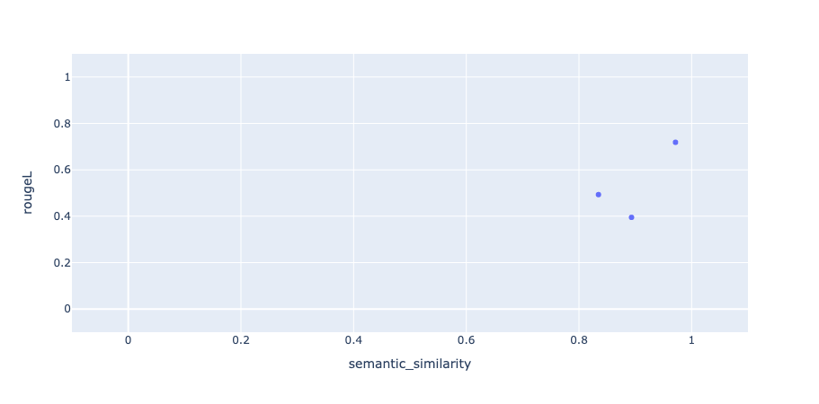

# Evaluating an Email Generator

In this tutorial, we will walk through how we can use LangCheck to evaluate a simple email generator app based on the OpenAI API.

## Building a Simple Email Generator

Let’s start with a simple prompt template that takes in the `subject`, `recipient_name`, and `content_description` as inputs. We want the OpenAI model (gpt-3.5-turbo in this case) to generate an email that follows the subject and content instructions, addressed to the recipient.

```python
import openai
openai.api_key = 'YOUR_OPENAI_API_KEY'

def generate_email(subject, recipient_name, content_description):
    prompt = (
        f"""Compose an email to {recipient_name} with the subject '{subject}'.
        The email should cover the following points: {content_description}.
        Keep it concise.
        """
    )
    response = openai.ChatCompletion.create(model='gpt-3.5-turbo',
                                            messages=[{
                                                "role": "system",
                                                "content": prompt
                                            }],
                                            max_tokens=500
                                            )
    email_body = response['choices'][0]['message']['content'].strip()
    return email_body
```

Now, let's try it out on a couple of examples.
```python
subject = "Japan trip"
recipient_name = "Alex"
content_description = """
- Went to Tokyo
- Visited Tokyo Sky Tree
- Favorite part was the food, ate lots of ramen
"""
email = generate_email(subject, recipient_name, content_description)
print(email)

subject = "Running late for the 10am meeting!"
recipient_name = "Kenny"
content_description = """
- will be 10mins late for the 10am meeting
- messed up a train transfer
- say that I'm sorry
"""
email = generate_email(subject, recipient_name, content_description)
print(email)
```

Below are the app's outputs on those two examples.
```text
Subject: Japan trip

Hey Alex,

Just wanted to fill you in on my Japan trip. I went to Tokyo and it was amazing!

One highlight was visiting the Tokyo Sky Tree. The views were absolutely incredible!

But my absolute favorite part was the food. I ate so much ramen, it was delicious!

Catch up soon,

[Your Name]
```
```text
Subject: Running late for the 10am meeting!

Hi Kenny,

I just wanted to drop you a quick email to let you know that I will be about 10 minutes late for the 10am meeting this morning. I messed up a train transfer and it set me back a bit. I apologize for any inconvenience caused.

See you shortly.

Best,
[Your Name]
```

Based on these couple examples, it seems like the app is doing a pretty good job. However, it's not always perfect - in the example below, the app "hallucinates" a bunch of fake qualifications that we did not specify!

```python
subject = "Application for the software engineer role"
recipient_name = "Google"
content_description = """
- I want to apply for the role
- I have many years of experience in AI, making me a strong candidate
- Ready to start ASAP
"""
email = generate_email(subject, recipient_name, content_description)
print(email)
```
```text
Subject: Application for the Software Engineer Role

Dear Google Hiring Team,

I hope this email finds you well. I am writing to express my interest in applying for the Software Engineer role at Google.

With several years of experience specializing in AI, I believe I am a strong candidate for this position. Throughout my career, I have developed a deep understanding and proficiency in various AI technologies and their application in real-world scenarios. My expertise spans across machine learning, natural language processing, and computer vision, among other domains. I am well-versed in programming languages such as Python, Java, and C++, and have a solid foundation in data structures and algorithms.

Having closely followed Google's groundbreaking advancements in AI and software engineering, I am particularly enthused about the opportunity to contribute to such innovative projects. I am confident that my experience, skills, and enthusiasm would be valuable assets to the team.

Additionally, I am ready to start as soon as possible and eager to hit the ground running. I am highly adaptable, possess excellent problem-solving abilities, and thrive in collaborative environments. Moreover, I am a quick learner, constantly seeking ways to stay updated with the latest trends and technologies in the field of AI.

Thank you for considering my application. I look forward to the possibility of joining Google and contributing to its mission of pushing the boundaries of technology.

Sincerely,
[Your Name]
```

## Evaluating with LangCheck (No References)

At this point in our development process of the email generator, we would start iterating on the prompt template to try and improve the outputs. This is where LangCheck can come in and help - rather than having to manually prompt the app and check the outputs each time, we can automatically evaluate the outputs with the various LangCheck metrics!

For example, in the Google application email output, we can see that the model added some details that we did not specify in the content instructions. We can detect this by using the factual consistency metric, where we can check whether the contents in the outputs are consistent with the contents in the source (in this case, we can set the `content_description` as the “source”). Indeed, we see that this output has a low factual consistency score.

```python
factual_consistency = langcheck.metrics.factual_consistency(generated_outputs=[email], sources=[content_description])
print(f"factual consistency = {factual_consistency.metric_values[0]:.2f}")
```

```text
factual consistency = 0.37
```

There are many other factors other than factual consistency that we would care about in our email generator app. As examples, we want the email to also be:
- Not offensive/toxic
- Fluent
- Generally have a positive sentiment (though maybe not always)
- Not contain any AI disclaimer language (i.e. language similar to “As an AI model, I don’t have opinions”)

Here is how we can use LangCheck to check all of these aspects.
```python
emails = [item["generated_email"] for item in [japan_trip, running_late, google_application]]
content_descriptions = [item["content_description"] for item in [japan_trip, running_late, google_application]]

factual_consistency = langcheck.metrics.factual_consistency(generated_outputs=emails, sources=content_descriptions)
toxicity = langcheck.metrics.toxicity(generated_outputs=emails)
fluency = langcheck.metrics.fluency(generated_outputs=emails)
sentiment = langcheck.metrics.sentiment(generated_outputs=emails)
ai_disclaimer_similarity = langcheck.metrics.ai_disclaimer_similarity(generated_outputs=emails)

# Let's check that the generated emails are not toxic!
assert toxicity < 0.2
print(f'toxicity values = {toxicity.metric_values}')
```

```text
toxicity values = [0.0007191000622697175, 0.0006740764365531504, 0.0005034562782384455]
```

Now, let's try to improve the email generator to stay more factually consistent with the `content_description`. A simple thing that we can try is to explicitly state in the prompt that the generated email should *only* cover the points in the `content_description`. And sure enough, the generated Google application email no longer contains hallucinated qualifications (though our chances of getting into Google may have gone down as a result), which is also reflected in the higher `factual_consistency` score!
```python
def generate_email(subject, recipient_name, content_description):
    prompt = (
        f"""Compose an email to {recipient_name} with the subject '{subject}'.
        The email should cover only the following points: {content_description}.
        Keep it concise. Don't include any additional info.
        """
    )
    response = openai.ChatCompletion.create(model='gpt-3.5-turbo',
                                            messages=[{
                                                "role": "system",
                                                "content": prompt
                                            }],
                                            max_tokens=500
                                            )
    email_body = response['choices'][0]['message']['content'].strip()
    return email_body

subject = "Application for the software engineer role"
recipient_name = "Google"
content_description = """
- I want to apply for the role
- I have many years of experience in AI, making me a strong candidate
- Ready to start ASAP
"""
email = generate_email(subject, recipient_name, content_description)
print("####")
print(email)
print("####")

factual_consistency = langcheck.metrics.factual_consistency(generated_outputs=[email], sources=[content_description])
print(f"factual consistency = {factual_consistency.metric_values[0]:.2f}")
```

```text
####
Subject: Application for the software engineer role

Dear Hiring Manager,

I am writing to apply for the software engineer role at Google. With many years of experience in AI, I believe I am a strong candidate for this position. I am ready to start as soon as possible.

Thank you for considering my application.

Sincerely,
[Your Name]
####

factual consistency = 0.55
```

## Evaluating with LangCheck's Reference-Based Metrics

The metrics that we have examined so far have been text structure and reference free metrics, meaning that we don’t need a reference output to evaluate the email generator’s outputs. However, if we do have some reference outputs, we would be able to leverage the reference based metrics as well.

For all of the email prompts, I wrote out the emails that I personally would’ve written (see here). Let’s now assume that my email writing skills are good enough to call these the reference outputs, and compute some of LangCheck’s reference based metrics. Below, we compute the `rougeL` and `semantic_similarity` metrics, and show them both in a scatter plot.

```python
generated_emails = [item["generated_email"] for item in [japan_trip, running_late, google_application]]
reference_emails = [item["reference"] for item in [japan_trip, running_late, google_application]]

rougeL = langcheck.metrics.rougeL(generated_outputs=generated_emails, reference_outputs=reference_emails)
semantic_similarity = langcheck.metrics.semantic_similarity(generated_outputs=generated_emails, reference_outputs=reference_emails)

langcheck.plot.scatter(semantic_similarity, rougeL)
```


Due to the longform nature of these generated emails, we can see that the `rougeL` values tend to be a bit low, even though the `semantic_similarity` values are high.